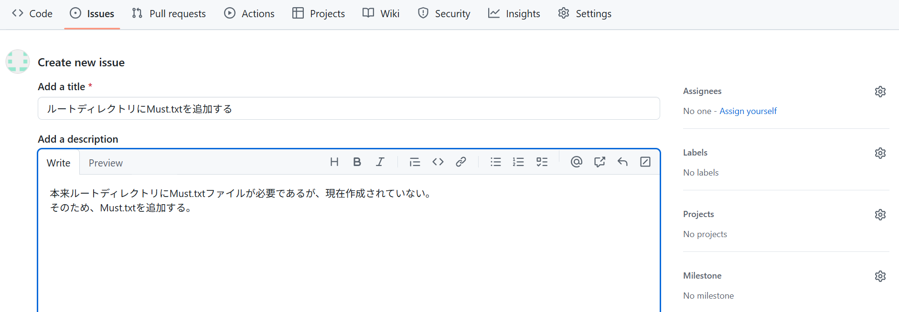

[TOP](../README.md)   
前: [ブランチを分ける](./branch.md)  
次: [リモートリポジトリのブランチを取得](../situation/fetch.md)  

---

# 2. 基礎
## 2-4. 実践
### プラクティス
2-1から2-3で学んだことを生かし、実践的なプラクティスを行ってみましょう。  
操作の説明は簡略化しますが、操作自体は変わりません。難しければこれまでのプラクティスを見返しても構いませんので、少しずつでも操作の流れに慣れていきましょう。  

```
シナリオ：
あなたはGitが採用されたプロジェクトにアサインされ、これから開発作業に参加します。  
足りないファイルがあるため、issueを作って対応するよう伝えられました。  
調べてみたところ、ルートディレクトリに`Must.txt`が無いようです。
```

1. コマンドプロンプトまたはPowerShellを使い、任意のディレクトリで`ターゲットリポジトリのクローンURL`を使いクローンしてください。
2. `ターゲットリポジトリのページ`にアクセスし、issueを作成してください。issueはシナリオを踏まえた内容にしてください。作成したissueのissue番号はおそらく`#3`になりますが、もし違っている場合は以降のissue番号を読み替えてください。
3. クローンしたターゲットリポジトリで新しいブランチを作成してください。ブランチ名は`3-ADDFILE`とします。
4. 先ほど作成したissueの内容で修正を行います。コミットのコメントは`#3 add file`とします。
5. ブランチをプッシュしてください。リモートのブランチ名はローカルのブランチ名と同じにします。
6. 先ほどプッシュしたブランチをmainブランチにマージするプルリクエストを作成してください。（プルリクエスト内に`Close #3`と書くのをおすすめします。マージ後にissueがクローズされます）
7. マージを行ってください。（実際の運用ではレビュー担当者またはマージ担当者にマージ作業を分担します）
8. ブランチをmainブランチに切り替え、ローカルリポジトリを更新してください。
9. 手順3で行った修正がローカルのmainブランチに反映されていることを確認してください。

プラクティスとしては取り上げませんが、以降は手順2～8を繰り返すことで開発作業を進めていくことができます。  
操作の流れに慣れてしまえば、Gitを通した開発作業にスムーズに対応できるようになると思います。まだ慣れていないと思ったら、繰り返し試してみてください。  

実際のプロジェクトでは、コミットの粒度やコメントの書き方が指定されていたり、マージリクエストを作成するタイミングが指定させていたりとルールに差があります。  
今回覚えた操作の流れを応用して対応していきましょう。  

<details>
<summary>
答え(一例です)
</summary>

1. 
ディレクトリにターゲットリポジトリクローンがない場合
```
> git clone {ターゲットリポジトリのクローンURL}
```
既にディレクトリにターゲットリポジトリクローンがある場合
```
> git switch main
> git pull
```

2. 
2-3のプラクティス4の解答例を参考に作成してください。作成手順はそこの解答例に記載されてますため、ここでは省略します。
issueの内容は以下を参考にしてください。


3. 
```
> git branch 3-ADDFILE
> git switch 3-ADDFILE
```

4. 
1.で作成したディレクトリ下のリポジトリクローン直下に`Must.txt`を作成してください。内容は任意です。
その後、以下のコマンドを実行してください。
```
> git add .
> git commit -m "#3 add file"
[3-ADDFILE c52f40f] #3 add file
 1 file changed, 0 insertions(+), 0 deletions(-)
 create mode 100644 Must.txt
```

5. 
```
> git push origin 3-ADDFILE
Enumerating objects: 3, done.
Counting objects: 100% (3/3), done.
Delta compression using up to 16 threads
Compressing objects: 100% (2/2), done.
Writing objects: 100% (2/2), 245 bytes | 245.00 KiB/s, done.
Total 2 (delta 0), reused 0 (delta 0), pack-reused 0 (from 0)
remote:
remote: Create a pull request for '3-ADDFILE' on GitHub by visiting:
remote:      https://github.com/kato-pra/git-practice-target/pull/new/3-ADDFILE
remote:
To https://github.com/kato-pra/git-practice-target.git
 * [new branch]      3-ADDFILE -> 3-ADDFILE
```

6. 
2-3のプラクティス10～11の解答例を参考に作成してください。作成手順はそこの解答例に記載されてますため、ここでは省略します。

7. 
2-3のプラクティス12の解答例を参考に作成してください。作成手順はそこの解答例に記載されてますため、ここでは省略します。

8. 
```
> git switch main
> git pull
remote: Enumerating objects: 1, done.
remote: Counting objects: 100% (1/1), done.
remote: Total 1 (delta 0), reused 0 (delta 0), pack-reused 0 (from 0)
Unpacking objects: 100% (1/1), 896 bytes | 149.00 KiB/s, done.
From https://github.com/kato-pra/git-practice-target
   ae05a9d..9de2237  main       -> origin/main
Updating ae05a9d..9de2237
Fast-forward
 Must.txt | 0
 1 file changed, 0 insertions(+), 0 deletions(-)
 create mode 100644 Must.txt
```

9. 
```
> git branch
  1-README
  3-ADDFILE
* main
> ls


    ディレクトリ: C:\Users\tie308747\Documents\git-test\git-practice-target


Mode                 LastWriteTime         Length Name
----                 -------------         ------ ----
-a----        2025/06/19     19:59              0 Must.txt
-a----        2025/06/19     19:24              0 README.md
```

</details>

--- 

[TOP](../README.md)   
前: [ブランチを分ける](./branch.md)  
次: [リモートリポジトリのブランチを取得](../situation/fetch.md)  