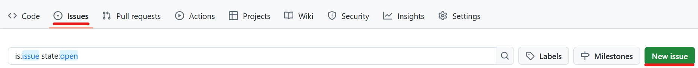

[TOP](../README.md)   
前: [リモートにプッシュ](./remote-push.md)  
次: [実践](./basic-practice.md)  

---

# 2. 基礎
## 2-3. ブランチを分ける
### 今回やることの図


### 用語
#### ブランチ
コミットを分岐して記録できるようにするものです。リポジトリ作成時にはローカル・リモート問わずmainブランチが存在しています。

#### マージ
分岐したブランチを他のブランチと合流させる操作のことです。

#### issue
プロジェクトにおけるタスクのことです。機能開発やバグ対応などをissueとして書き出しておき、issueごとにブランチを作成してタスクを実行することで、タスクとコードを紐づけて管理することができます。
なおGitに備わった仕組みではなく、GitHubやGitLabなどリモートリポジトリ機能を持つサービスに備わった仕組みです。  

#### プルリクエスト/マージリクエスト
ブランチをマージする際、変更点を確認できる仕組みです。レビューに使うことができます。  
なおこれもGitに備わった仕組みではなく、GitHubやGitLabなどリモートリポジトリ機能を持つサービスに備わった仕組みです。GitHubではプルリクエスト、GitLabではマージリクエストと呼びます。

### プラクティス

GitHubのissueを作成してみます。  
その後、issueに紐づく新しいブランチを`git branch {ブランチ名}`で作成し、`git switch {ブランチ名}`変更を行います。その後、作成したブランチをリモートリポジトリへプッシュし、プルリクエスト機能を使ってみます。  
なお、`git branch`を実行するとブランチ一覧と現在のブランチを確認できます。  

1. コマンドプロンプトまたはPowerShellを使い、任意のディレクトリで`ターゲットリポジトリのクローンURL`を使いクローンしてください。ターゲットリポジトリを作成していない場合は、[GitHubの設定](../preparation/github.md)を行ってください。（[2-2](#2-2-リモートにプッシュ)で実行している場合は不要です）
2. cdコマンドを実行し、ディレクトリ`git-practice-target`へ移動してください。（[2-2](#2-2-リモートにプッシュ)で実行している場合は不要です）
3. ローカルリポジトリのブランチ一覧を確認し、以下のような出力になることを確認してください。
```
* main
```
4. ブラウザで`ターゲットリポジトリのページ`にアクセスし、"Issues > New issue"より、以下の内容を入力し`Create`でissueを作成してください。
    - Title: READMEファイル追加
5. issueに対応するため、issue番号を先頭に加えた新しいブランチを作成し、切り替えてください。（今回の例では`1-README`というブランチ名にしてください）
6. ローカルリポジトリのブランチ一覧を確認し、以下のような出力になることを確認してください。
```
* 1-README
  main
```
7. ファイル`README.md`を作成してください。
8. すべてのファイルをステージングし、コメント`#1 add file`をつけてコミットしてください。コミットメッセージに`#<issue番号>`を付けることで、issueとコミットを紐づけることができます。
9. リモートリポジトリを更新してください。リポジトリは`origin`、ローカルブランチは`1-README`、リモートブランチは`1-README`です。（コマンドの書き方は「git ブランチ指定」などで検索してください）以下のような出力になることを確認してください。
```
Counting objects: 2, done.
Compressing objects: 100% (2/2), done.
Writing objects: 100% (2/2), 240 bytes | 240.00 KiB/s, done.
Total 2 (delta 0), reused 0 (delta 0)
remote: 
remote: Create a pull request for '1-README' on GitHub by visiting:
remote:      https://github.com/xxxxx/git-practice-target/pull/new/1-README
remote: 
To https://github.com/xxxxx/git-practice-target.git
 * [new branch]      1-README -> 1-README
```
10. ブラウザで`ターゲットリポジトリのページ`にアクセスし、`main`と書かれたプルダウンをクリックし、先ほど作成したブランチ「1-README」がリモートリポジトリにプッシュされ、表示されることを確認してください。
11. 同ページの「Compare& pull request」ボタンより、以下の内容でプルリクエストを作成してください。入力後、「Create pull request」ボタンをクリックしてください。 
    - Title: READMEファイル追加
    - Comment: Close #1
12. 「Merge pull request」ボタンをクリックし、ブランチ`1-README`をmainブランチにマージしてください。（実際の運用ではレビュー担当者またはマージ担当者にマージ作業を分担し、チェックしてもらいます）
13. ブラウザで`ターゲットリポジトリのページ`のmainブランチの内容を確認し、先ほど追加したファイルがmainブランチに反映されていることを確認してください。
14. ブラウザで`ターゲットリポジトリのページ`のissuesタブにアクセスし、手順4で作成したissueがクローズされていることを確認してください。クローズされたissueを開き、`added a commit that references this issue`という文章と共に手順8で行ったコミットが表示されており、issueとコミットが紐づいていることを確認してください。

ここまでの内容で、ブランチとissueについて学ぶことができました。これにより、実際のプロジェクトにおいても複数人と並行して開発作業を行うことができるようになります。  

### TIPS
- mainブランチにマージしたブランチの変更履歴は削除できずに残り続けます。アクセスキーやパスワード、秘密鍵などの漏洩させてはいけない情報は、一時的にでも絶対にプッシュしないように気をつけてください。

<details>
<summary>
答え(一例です)
</summary>

1. 2-2で行っているため省略
2. 2-2で行っているため省略
3. 
```
> git branch
* main
```

4. 



5. 
```
> git branch 1-README
> git switch 1-README
Switched to branch '1-README'
```

6. 
```
> git branch
* 1-README
  main
```

7. ファイル作成はGUIでも可能なため省略
8. 
```
> git add .
> git commit -m "#1 add file"
[1-README f7338db] #1 add file
 1 file changed, 0 insertions(+), 0 deletions(-)
 create mode 100644 README.md
```

9. 
```
> git push origin 1-README
Enumerating objects: 4, done.
Counting objects: 100% (4/4), done.
Writing objects: 100% (3/3), 241 bytes | 241.00 KiB/s, done.
Total 3 (delta 0), reused 0 (delta 0), pack-reused 0 (from 0)
remote:
remote: Create a pull request for '1-README' on GitHub by visiting:
remote:      https://github.com/kato-pra/git-practice-target/pull/new/1-README
remote:
To https://github.com/kato-pra/git-practice-target.git
 * [new branch]      1-README -> 1-README
```

10. 


11. 


12. 


13. 


14. 


</details>

--- 

[TOP](../README.md)   
前: [リモートにプッシュ](./remote-push.md)  
次: [実践](./basic-practice.md)  