[TOP](../README.md)   
前: [リモートにプッシュ](./remote-push.md)  
次: [実践](./basic-practice.md)  

---

# 2. 基礎
## 2-3. ブランチを分ける
### 今回やることの図



### 用語
#### ブランチ
コミットを分岐して記録できるようにするものです。ローカル・リモート問わずリポジトリ作成時にはmasterブランチが存在しています。

#### マージ
分岐したブランチを他のブランチと合流させる操作のことです。

#### issue
プロジェクトにおけるタスクのことです。機能開発やバグ対応などをissueとして書き出しておき、issueごとにブランチを作成してタスクを実行することで、タスクとコードを紐づけて管理することができます。
なおGitに備わった仕組みではなく、GithubやGitLabなどリモートリポジトリ機能を持つサービスに備わった仕組みです。  

#### プルリクエスト/マージリクエスト
ブランチをマージする際、変更点を確認できる仕組みです。レビューに使うことができます。  
なおGitに備わった仕組みではなく、GithubやGitLabなどリモートリポジトリ機能を持つサービスに備わった仕組みです。Githubではプルリクエスト、GitLabではマージリクエストと呼びます。

### プラクティス

GitLabのissueに紐づく新しいブランチを`git checkout -b`で作成し、issueに従って変更を行います。その後、作成したブランチをリモートリポジトリへプッシュし、マージリクエスト機能を使ってみます。  
なお、`git branch`を実行するとブランチ一覧と現在のブランチを確認できます。  
GitLabからログインを求められた場合は、以下のユーザ/パスワードを使用してください。  
git-practice/git-practice  

1. コマンドプロンプトまたはPowerShellを使い、任意のディレクトリで`http://ec2-54-65-130-40.ap-northeast-1.compute.amazonaws.com/container/git-practice-target.git`をクローンしてください。（[2-2](#2-2-リモートにプッシュ)で実行している場合は不要です）
2. cdコマンドを実行し、ディレクトリ「git-practice-target」へ移動してください。（[2-2](#2-2-リモートにプッシュ)で実行している場合は不要です）
3. ローカルリポジトリのブランチ一覧を確認し、以下のような出力になることを確認してください。
```
* master
```
4. ブラウザで[GitLab git-practice-target issue#1](http://ec2-54-65-130-40.ap-northeast-1.compute.amazonaws.com/container/git-practice-target/-/issues/1)にアクセスし、これから対応するissueのページを開きます。
5. issueに対応するため、issue番号を先頭に加えた新しいブランチを作成してください。（今回の例では「1-<任意文字列>」というブランチ名にしてください）
6. ローカルリポジトリのブランチ一覧を確認し、以下のような出力になることを確認してください。
```
* 1-<任意文字列>
  master
```
7. 先ほどブラウザで開いたissueの説明に従って、修正を行ってください。
8. すべてのファイルをステージングし、コメント「add file」をつけてコミットしてください。
9. リモートリポジトリを更新してください。リポジトリは`origin`、ローカルブランチは`1-<任意文字列>`、リモートブランチは`1-<任意文字列>`です。（コマンドの書き方は「git ブランチ指定」などで検索してください）以下のような出力になることを確認してください。
```
Enumerating objects: 4, done.
Counting objects: 100% (4/4), done.
Delta compression using up to 8 threads
Compressing objects: 100% (2/2), done.
Writing objects: 100% (3/3), 312 bytes | 312.00 KiB/s, done.
Total 3 (delta 0), reused 0 (delta 0), pack-reused 0
remote:
remote: To create a merge request for issue#1, visit:
remote:   http://ec2-54-65-130-40.ap-northeast-1.compute.amazonaws.com/container/git-practice-target/-/merge_requests/new?merge_request%5Bsource_branch%5D=1
remote:
To http://ec2-54-65-130-40.ap-northeast-1.compute.amazonaws.com/container/git-practice-target.git
 * [new branch]      1-<任意文字列> -> 1-<任意文字列>
```
10. ブラウザで[GitLab git-practice-target branches](http://ec2-54-65-130-40.ap-northeast-1.compute.amazonaws.com/container/git-practice-target/-/branches)にアクセスし、先ほど作成したブランチ「1-<任意文字列>」がリモートリポジトリにプッシュされていることを確認してください。
11. ブランチ「1-<任意文字列>」右側の「Merge request」ボタンをクリックし、以下の内容でマージリクエストを作成してください。入力後、「Submit merge request」ボタンをクリックしてください。 
```
Title: #1 テキストファイル編集
Description:
# 関連するIssue
container/git-practice-target#1

# MRの内容
- テキストファイル「<社員番号>.txt」を作成

```
12. 「Merge」ボタンをクリックし、ブランチ「1-<任意文字列>」をmasterブランチにマージしてください。（本当はレビュー担当者またはマージ担当者にマージ作業を分担します）
13. ブラウザで[masterブランチ](http://ec2-54-65-130-40.ap-northeast-1.compute.amazonaws.com/container/git-practice-target/-/blob/master/)の内容を確認し、先ほど編集したファイルがmasterブランチに反映されていることを確認してください。

ここまでの内容で、ブランチとissueについて学ぶことができました。これにより、実際のプロジェクトにおいても複数人と並行して開発作業を行うことができるようになります。  

### TIPS
- masterブランチにマージしたブランチの変更履歴は削除できずに残り続けます。アクセスキーやパスワード、秘密鍵などの漏洩させてはいけない情報は、一時的にでも絶対にプッシュしないように気をつけてください。

--- 

[TOP](../README.md)   
前: [リモートにプッシュ](./remote-push.md)  
次: [実践](./basic-practice.md)  