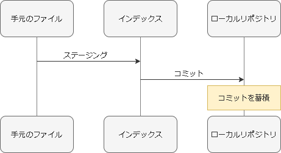

[TOP](../README.md)   
前: [Gitの設定](../preparation/gitconfig.md)  
次: [リモートにプッシュ](./remote-push.md)  

---

# 2. 基礎
Gitの基礎について学びます。  
2-1から2-3では用語とコマンドを覚えながらGitを扱っていきます。  

## 2-1. ローカルでコミット

### 今回やることの図



### 用語
#### ローカルリポジトリ
自分のマシン上でファイルやディレクトリの状態を記録する場所です。ファイルやディレクトリの変更履歴が格納されます。

#### コミット
ファイルやディレクトリの追加・変更をリポジトリに記録する操作です。操作を行うと、ローカルリポジトリに前回コミットから現在までの差分を記録します。記録された差分の情報のこともコミットと呼びます。

#### インデックス（ステージング）
ファイルやディレクトリを変更した後、コミットの対象とするファイルやディレクトリを登録しておくものをインデックスと呼びます。インデックスに登録する操作をステージングと呼びます。  
インデックスに登録されていないファイルやディレクトリはコミット対象にならないため、コミットを行う前にステージングを行う必要があります。  


### プラクティス
任意のディレクトリで`git init`を実行するとそのディレクトリはローカルリポジトリの管理下に置かれます。ファイルを変更した後、`git add`を実行するとファイルの変更はインデックスに登録されます。`git commit`を実行するとインデックスに登録された内容をコミットとしてローカルリポジトリに記録します。  
なお、`git status`を実行するとインデックスの状態を確認できます。`git log`を実行するとコミットの履歴を確認できます。

1. 任意の位置にディレクトリ`git-practice-local`を作成してください。（手段は問いません）
2. コマンドプロンプトまたはPowerShellでcdコマンドを実行し、ディレクトリ`git-practice-local`へ移動してください。
3. `git-practice-local`をGitのローカルリポジトリ管理下に初期化してください。
4. ファイル`2-1.txt`を作成してください。（手段は問いません）
5. 作成したファイル`2-1.txt`をステージングしてください。
6. インデックスの状態を確認してください。以下のような出力になり、ファイル`2-1.txt`がインデックスに記録されていることを確認してください。
```
On branch main

No commits yet

Changes to be committed:
  (use "git rm --cached <file>..." to unstage)
        new file:   2-1.txt
```
7. コメント`first commit`をつけてコミットしてください。
8. 再度インデックスの状態を確認してください。以下のような出力になり、ファイル`2-1.txt`がインデックスから消えていることを確認してください。
```
On branch main
nothing to commit, working tree clean
```
9. コミットの履歴を確認してください。以下のような出力になり、ローカルリポジトリにコミットが記録されていることを確認してください。
```
commit e24bd3e10037e21b1619f596979c450516633313 (HEAD -> main)
Author: xx xx <xxxxx.xxx@tis.co.jp>
Date:   Tue Jul 28 11:38:51 2020 +0900

    first commit
```

ここまでの内容で、ローカルリポジトリにコミットを記録していくことができるようになりました。コミットが記録されていることで、容易に特定時点のファイル内容を復元できます。個人で開発する場合はローカルリポジトリへの記録で構いませんが、多人数で開発する場合はリモートリポジトリへ記録していくことになります。次項ではリモートリポジトリを交えたGitの使い方を学んでいきます。

<details>
<summary>
答え(一例です)
</summary>

1. ディレクトリ作成はGUIでも可能なため省略

2. 
```
> cd "C:\Users\tie308747\Documents\git-test\git-practice-local"
上記のパスは例です
移動したいディレクトリを選択した状態で「Shift + 右クリック」で「パスのコピー」が表示されるため、それを使いコピペすると楽です
```

3. 
```
> ls
> git init
Initialized empty Git repository in C:/Users/tie308747/Documents/git-test/git-practice-local/.git/
> ls -Force


    ディレクトリ: C:\Users\tie308747\Documents\git-test\git-practice-local


Mode                 LastWriteTime         Length Name
----                 -------------         ------ ----
d--h--        2025/06/13     16:33                .git
```

4. ファイル作成はGUIでも可能なため省略

5. 
```
git add .
```

6. 
```
> git status
On branch master

No commits yet

Changes to be committed:
  (use "git rm --cached <file>..." to unstage)
        new file:   2-1.txt
```

7. 
```
> git commit -m "first commit"
[master (root-commit) 7b54505] first commit
 1 file changed, 0 insertions(+), 0 deletions(-)
 create mode 100644 2-1.txt
```

8. 
```
> git status
On branch master
nothing to commit, working tree clean
```

9. 
```
> git log
commit 7b54505c37b14c21a811e02d647fcd5eb0b3d6ac (HEAD -> master)
Author: kato-pra <kato.kenta@tis.co.jp>
Date:   Fri Jun 13 16:40:29 2025 +0900

    first commit
```

</details>
--- 

[TOP](../README.md)   
前: [Gitの設定](../preparation/gitconfig.md)  
次: [リモートにプッシュ](./remote-push.md)  