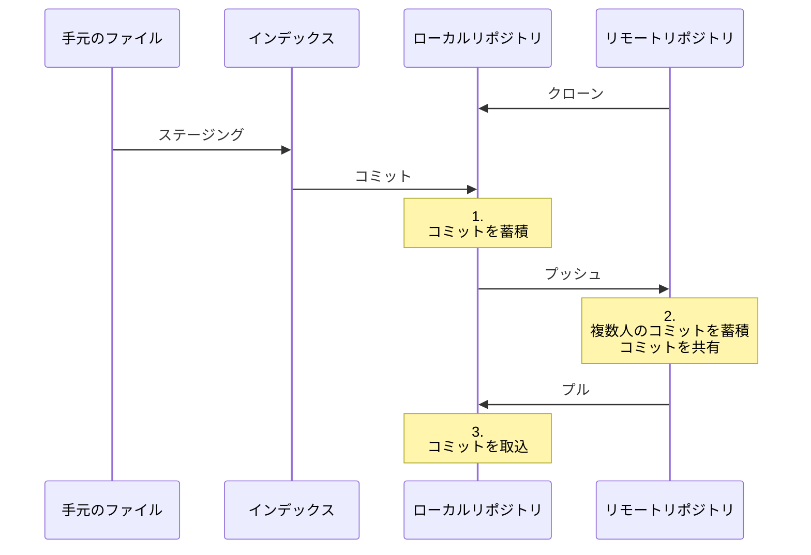

[TOP](../README.md)   
前: [ローカルでコミット](./local-commit.md)  
次: [ブランチを分ける](./branch.md)  

---

# 2. 基礎
## 2-2. リモートにプッシュ
### 今回やることの図



### 用語
#### リモートリポジトリ
共有サーバ上でファイルやディレクトリの状態を記録する場所です。

#### クローン
リモートリポジトリを複製し、ローカルリポジトリを作成する操作です。ファイルやディレクトリがダウンロードされるのに加え、変更履歴も複製されます。

#### プッシュ
ローカルリポジトリの変更履歴をアップロードし、リモートリポジトリを更新する操作です。

#### プル
リモートリポジトリの変更履歴をダウンロードし、ローカルリポジトリを更新する操作です。

### プラクティス
`git clone`を実行することでリモートリポジトリの既存プロジェクトを手元にクローンすることができます。クローンしたファイルに変更を加え、`git push`でリモートリポジトリへ変更履歴をアップロードしてみます。その後、他の人がリモートリポジトリのファイルを更新した体で`git pull`を実行し、手元のローカルリポジトリを更新してみます。  
GitLabからログインを求められた場合は、以下のユーザ/パスワードを使用してください。  
git-practice/git-practice  

1. コマンドプロンプトまたはPowerShellを使い、任意のディレクトリで`http://ec2-54-65-130-40.ap-northeast-1.compute.amazonaws.com/container/git-practice-target.git`をクローンしてください。
2. cdコマンドを実行し、ディレクトリ「git-practice-target」へ移動してください。
3. ファイル「<社員番号>.txt」を作成してください。（手段は問いません。自身の社員番号をファイル名にしてください）
4. すべてのファイルをステージングしてください。
5. コメント「add file」をつけてコミットしてください。
6. リモートリポジトリを更新してください。リポジトリは`origin`、ブランチは`master`です。以下のような出力になることを確認してください。
```
Enumerating objects: 4, done.
Counting objects: 100% (4/4), done.
Delta compression using up to 8 threads
Compressing objects: 100% (2/2), done.
Writing objects: 100% (3/3), 284 bytes | 284.00 KiB/s, done.
Total 3 (delta 0), reused 0 (delta 0), pack-reused 0
To http://ec2-54-65-130-40.ap-northeast-1.compute.amazonaws.com/container/git-practice-target.git
   30bd289..0dea3af  master -> master
```
7. ブラウザで[GitLab git-practice-target](http://ec2-54-65-130-40.ap-northeast-1.compute.amazonaws.com/container/git-practice-target)にアクセスしてください。先ほどプッシュした内容が反映され、手順3で作成したファイルがリモートリポジトリに追加されていることを確認してください。
8. [GitLab git-practice-target](http://ec2-54-65-130-40.ap-northeast-1.compute.amazonaws.com/container/git-practice-target)の「＋マーク > New file」をクリックしてください。ファイル名を「<社員番号>-extra.txt」とし、「Commit changes」をクリックしてください。（内容は適当で構いません）
9. コマンドプロンプトまたはPowerShellを使い、ローカルリポジトリを更新してください。以下のような出力になることを確認してください。
```
remote: Enumerating objects: 3, done.
remote: Counting objects: 100% (3/3), done.
remote: Compressing objects: 100% (2/2), done.
remote: Total 2 (delta 0), reused 0 (delta 0), pack-reused 0
Unpacking objects: 100% (2/2), 268 bytes | 11.00 KiB/s, done.
From http://ec2-54-65-130-40.ap-northeast-1.compute.amazonaws.com/container/git-practice-target
   0dea3af..abe1aae  master     -> origin/master
Updating 0dea3af..abe1aae
Fast-forward
 <社員番号>-extra.txt | 0
 1 file changed, 0 insertions(+), 0 deletions(-)
 create mode 100644 <社員番号>-extra.txt
```
10.  実際にファイルを開いたり、コミットの履歴を確認したりして、リモートリポジトリに対して行われた変更が手元に反映されていることを確認してください。
11.  手順3・手順8で作成したファイルを削除してください。（手段は問いません）
12.  すべてのファイルをステージングし、コメント「delete files」をつけてコミットし、リモートリポジトリを更新してください。リポジトリは`origin`、ブランチは`master`です。
13.  ブラウザで[GitLab git-practice-target](http://ec2-54-65-130-40.ap-northeast-1.compute.amazonaws.com/container/git-practice-target)にアクセスしてください。先ほどプッシュした内容が反映され、手順3・手順8で作成したファイルがリモートリポジトリから削除されていることを確認してください。

ここまでの内容で、リモートリポジトリを用いて複数人で開発をすることができるようになりました。手元で変更した内容は適宜コミットし、ある程度コミットが溜まったらリモートリポジトリにプッシュします。コミットやプッシュの粒度はプロジェクトによって決められている場合が多いため、指針がある場合はそれに従ってください。  
リモートリポジトリを用いた開発を学習しましたが、実際の開発作業では複数の機能追加やリリースバージョンが並行して存在する場合が多々あります。その際、複数の変更履歴が混在してしまうと全容の把握が難しくなります。次項では「ブランチ」という概念を学び、この問題点を解決します。

--- 

[TOP](../README.md)   
前: [ローカルでコミット](./local-commit.md)  
次: [ブランチを分ける](./branch.md)  