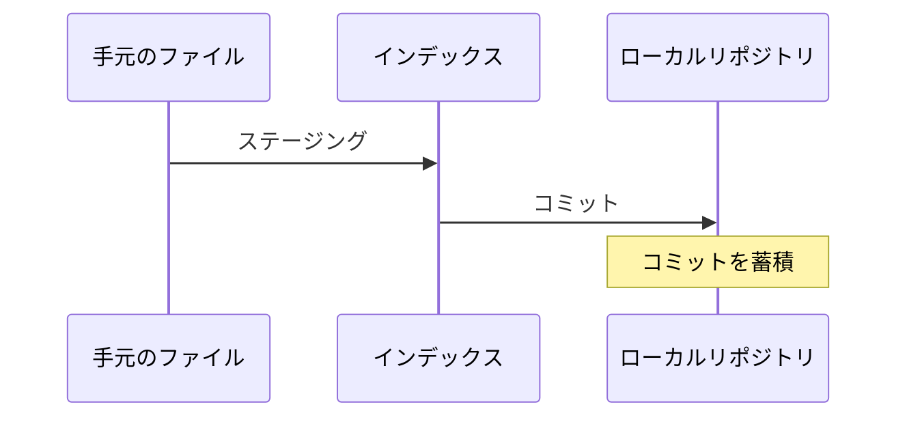
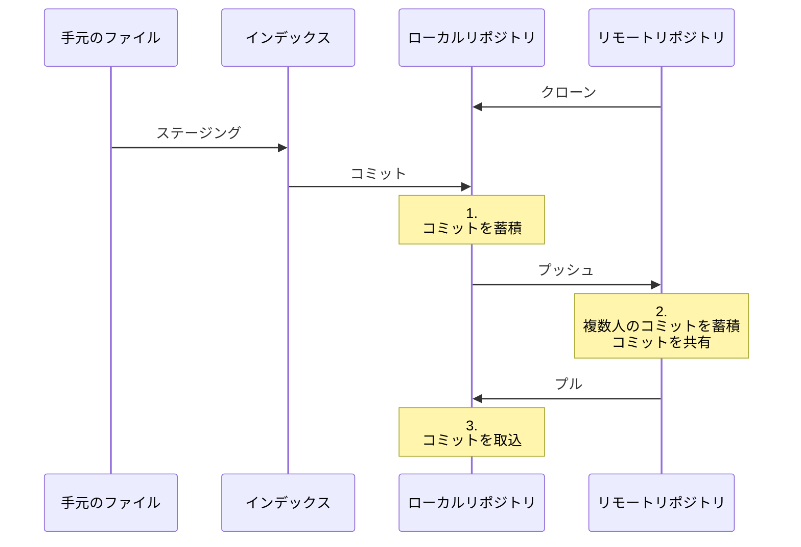

# git-practice
## 1. はじめに
## 1-1. Gitについて
Gitは分散型バージョン管理システムです。  
コードやファイルの更新履歴を記録していき、過去の状態を確認したり、最新の状態との差分を見たりできます。  
また、同じコードやファイルを更新した場合でも安全に更新を進める仕組みが備わっています。  
複数人で効率的に開発を行うことができるため、プロジェクトで採用されるケースが多くなっています。  

Gitが採用されたプロジェクトにスムーズに参加できるよう、Git-practiceを使って練習してみましょう。  

## 1-2. インストール
それではGitをインストールします。  
Git-practiceではGitのバージョンは問いませんが、2.0.0以降を推奨します。  

使用するOSによってインストール手順に違いがあるため、自身の環境に合わせて選択してください。また、WSL（Windows Subsystem for Linux）の一部ディストリビューションではデフォルトでインストールされている場合があります。  

本項ではOSがLinuxの場合とWindowsの場合について解説します。  

### Linuxの場合
1. ターミナルで各パッケージマネージャーを使用してインストールしてください。  

apt-getが使用できる場合は、以下のコマンドを実行してください。  
`sudo apt-get install git`  

yumが使用できる場合は、以下のコマンドを実行してください。  
`sudo yum install git`  

2. `git --version`を実行し、Gitがインストールされたことを確認してください。以下のような出力になります。
```
git version 2.17.1
```

### Windowsの場合
1. ブラウザで[Git for Windows](https://git-scm.com/download/win)へアクセスしてください。インストーラのダウンロードが始まります。
2. インストーラを起動してください。オプションはすべてデフォルトのままで構いません。`Next`をクリックし、インストールを進めてください。
3. コマンドプロンプトまたはPowerShellで`git --version`を実行し、Gitがインストールされたことを確認してください。以下のような出力になります。
```
git version 2.28.0.windows.1
```

## 1-3. 事前準備
前項でGitのインストールが終了しているものとします。  
Git-practiceを実施していくにあたり、必要な設定や環境によって必要な設定が存在します。  
これらは`git config`コマンドを実行して設定します。  
必要な設定  
- ユーザ名/メールアドレス

環境によって必要な設定
- プロキシ

### ユーザ名/メールアドレス
Gitを使用する際、任意のユーザ名及び任意のメールアドレスの設定が必要です。  
今回はユーザ名を社員番号、メールアドレスをTISドメインの個人メールアドレスとしてください。
ここで設定したユーザ名/メールアドレスは、コミット（2-1にて後述）の際にログに残っていくことになります。
1. `git config --global user.name <社員番号>`を実行してください。
2. `git config --global user.email <TISドメインの個人メールアドレス>`を実行してください。
3. `git config --global --list`を実行し、先ほど設定したユーザ名/メールアドレスが存在することを確認してください。

### プロキシ
プロキシを通してリモートリポジトリ（2-2にて後述）にアクセスする場合、Git側にプロキシ設定が必要です。http、httpsの2種類を設定可能です。  
プロキシサーバのユーザ名/パスワードはTETRAのユーザ名/パスワードを使用してください。
1. `git config --global http.proxy http://<ユーザ名>:<パスワード>@ex-tkyproxy.intra.tis.co.jp:8080`を実行してください。
2. 必要な場合は、`git config --global https.proxy http://<ユーザ名>:<パスワード>@ex-tkyproxy.intra.tis.co.jp:8080`を実行してください。
3. `git config --global --list`を実行し、先ほど設定したプロキシが存在することを確認してください。


## 2. 基礎
Gitの基礎について学びます。  
2-1から2-3では用語とコマンドを覚えながらGitを扱っていきます。  

## 2-1. ローカルでコミット

### 今回やることの図



### 用語
#### ローカルリポジトリ
自分のマシン上でファイルやディレクトリの状態を記録する場所です。ファイルやディレクトリの変更履歴が格納されます。

#### コミット
ファイルやディレクトリの追加・変更をリポジトリに記録する操作です。操作を行うと、ローカルリポジトリに前回コミットから現在までの差分を記録します。記録された差分の情報のこともコミットと呼びます。

#### インデックス（ステージング）
ファイルやディレクトリを変更した後、コミットの対象とするファイルやディレクトリを登録しておくものをインデックスと呼びます。インデックスに登録する操作をステージングと呼びます。  
インデックスに登録されていないファイルやディレクトリはコミットされないため、コミットを行う前にステージングを行う必要があります。  


### プラクティス
任意のディレクトリで`git init`を実行するとそのディレクトリはローカルリポジトリの管理下に置かれます。ファイルを変更した後、`git add`を実行するとファイルの変更はインデックスに登録されます。`git commit`を実行するとインデックスに登録された内容をコミットとしてローカルリポジトリに記録します。  
なお、`git status`を実行するとインデックスの状態を確認できます。`git log`を実行するとコミットの履歴を確認できます。

1. 任意の位置にディレクトリ「git-practice-local」を作成してください。（手段は問いません）
2. コマンドプロンプトまたはPowerShellでcdコマンドを実行し、ディレクトリ「git-practice-local」へ移動してください。
3. 「git-practice-local」をGitのローカルリポジトリ管理下に初期化してください。
4. ファイル「2-1.txt」を作成してください。（手段は問いません）
5. 作成したファイル「2-1.txt」をステージングしてください。
6. インデックスの状態を確認してください。以下のような出力になり、ファイル「2-1.txt」がインデックスに記録されていることを確認してください。
```
On branch master

No commits yet

Changes to be committed:
  (use "git rm --cached <file>..." to unstage)
        new file:   2-1.txt
```
7. コメント「first commit」をつけてコミットしてください。
8. インデックスの状態を確認してください。以下のような出力になり、ファイル「2-1.txt」がインデックスから消えていることを確認してください。
```
On branch master
nothing to commit, working tree clean
```
9. コミットの履歴を確認してください。以下のような出力になり、ローカルリポジトリにコミットが記録されていることを確認してください。
```
commit e24bd3e10037e21b1619f596979c450516633313 (HEAD -> master)
Author: xx xx <xxxxx.xxx@tis.co.jp>
Date:   Tue Jul 28 11:38:51 2020 +0900

    first commit
```

ここまでの内容で、ローカルリポジトリにコミットを記録していくことができるようになりました。コミットが記録されていることで、容易に特定時点のファイル内容を復元できます。個人で開発する場合はローカルリポジトリへの記録で構いませんが、多人数で開発する場合はリモートリポジトリへ記録していくことになります。次項ではリモートリポジトリを交えたGitの使い方を学んでいきます。

## 2-2. リモートにプッシュ
### 今回やることの図



### 用語
#### リモートリポジトリ
共有サーバ上でファイルやディレクトリの状態を記録する場所です。

#### クローン
リモートリポジトリを複製し、ローカルリポジトリを作成する操作です。ファイルやディレクトリがダウンロードされるのに加え、変更履歴も複製されます。

#### プッシュ
ローカルリポジトリの変更履歴をアップロードし、リモートリポジトリを更新する操作です。

#### プル
リモートリポジトリの変更履歴をダウンロードし、ローカルリポジトリを更新する操作です。

### プラクティス
`git clone`を実行することでリモートリポジトリの既存プロジェクトを手元にクローンすることができます。クローンしたファイルに変更を加え、`git push`でリモートリポジトリへ変更履歴をアップロードしてみます。その後、他の人がリモートリポジトリのファイルを更新した体で`git pull`を実行し、手元のローカルリポジトリを更新してみます。  
GitLabからログインを求められた場合は、以下のユーザ/パスワードを使用してください。  
git-practice/git-practice  

1. コマンドプロンプトまたはPowerShellを使い、任意のディレクトリで`http://ec2-54-65-130-40.ap-northeast-1.compute.amazonaws.com/cicd-study-public/git-practice-target.git`をクローンしてください。
2. cdコマンドを実行し、ディレクトリ「git-practice-target」へ移動してください。
3. ファイル「<社員番号>.txt」を作成してください。（手段は問いません。自身の社員番号をファイル名にしてください）
4. すべてのファイルをステージングしてください。
5. コメント「add file」をつけてコミットしてください。
6. リモートリポジトリを更新してください。リポジトリは`origin`、ブランチは`master`です。以下のような出力になることを確認してください。
```
Enumerating objects: 4, done.
Counting objects: 100% (4/4), done.
Delta compression using up to 8 threads
Compressing objects: 100% (2/2), done.
Writing objects: 100% (3/3), 284 bytes | 284.00 KiB/s, done.
Total 3 (delta 0), reused 0 (delta 0), pack-reused 0
To http://ec2-54-65-130-40.ap-northeast-1.compute.amazonaws.com/cicd-study-public/git-practice-target.git
   30bd289..0dea3af  master -> master
```
7. ブラウザで[GitLab git-practice-target](http://ec2-54-65-130-40.ap-northeast-1.compute.amazonaws.com/cicd-study-public/git-practice-target)にアクセスしてください。先ほどプッシュした内容が反映され、手順3で作成したファイルがリモートリポジトリに追加されていることを確認してください。
8. [GitLab git-practice-target](http://ec2-54-65-130-40.ap-northeast-1.compute.amazonaws.com/cicd-study-public/git-practice-target)の「＋マーク > New file」をクリックしてください。ファイル名を「<社員番号>-extra.txt」とし、「Commit changes」をクリックしてください。（内容は適当で構いません）
9. コマンドプロンプトまたはPowerShellを使い、ローカルリポジトリを更新してください。以下のような出力になることを確認してください。
```
remote: Enumerating objects: 3, done.
remote: Counting objects: 100% (3/3), done.
remote: Compressing objects: 100% (2/2), done.
remote: Total 2 (delta 0), reused 0 (delta 0), pack-reused 0
Unpacking objects: 100% (2/2), 268 bytes | 11.00 KiB/s, done.
From http://ec2-54-65-130-40.ap-northeast-1.compute.amazonaws.com/cicd-study-public/git-practice-target
   0dea3af..abe1aae  master     -> origin/master
Updating 0dea3af..abe1aae
Fast-forward
 <社員番号>-extra.txt | 0
 1 file changed, 0 insertions(+), 0 deletions(-)
 create mode 100644 <社員番号>-extra.txt
```
10.  実際にファイルを開いたり、コミットの履歴を確認したりして、リモートリポジトリに対して行われた変更が手元に反映されていることを確認してください。
11.  手順3・手順8で作成したファイルを削除してください。（手段は問いません）
12.  すべてのファイルをステージングし、コメント「delete files」をつけてコミットし、リモートリポジトリを更新してください。リポジトリは`origin`、ブランチは`master`です。
13.  ブラウザで[GitLab git-practice-target](http://ec2-54-65-130-40.ap-northeast-1.compute.amazonaws.com/cicd-study-public/git-practice-target)にアクセスしてください。先ほどプッシュした内容が反映され、手順3・手順8で作成したファイルがリモートリポジトリから削除されていることを確認してください。

ここまでの内容で、リモートリポジトリを用いて複数人で開発をすることができるようになりました。手元で変更した内容は適宜コミットし、ある程度コミットが溜まったらリモートリポジトリにプッシュします。コミットやプッシュの粒度はプロジェクトによって決められている場合が多いため、指針がある場合はそれに従ってください。  
リモートリポジトリを用いた開発を学習しましたが、実際の開発作業では複数の機能追加やリリースバージョンが並行して存在する場合が多々あります。その際、複数の変更履歴が混在してしまうと全容の把握が難しくなります。次項では「ブランチ」という概念を学び、この問題点を解決します。

## 2-3. ブランチを分ける
### 今回やることの図


### 用語
#### ブランチ
コミットを分岐して記録できるようにするものです。ローカル・リモート問わずリポジトリ作成時にはmasterブランチが存在しています。

#### マージ
分岐したブランチを他のブランチと合流させる操作のことです。

#### issue
プロジェクトにおけるタスクのことです。機能開発やバグ対応などをissueとして書き出しておき、issueごとにブランチを作成してタスクを実行することで、タスクとコードを紐づけて管理することができます。
なおGitに備わった仕組みではなく、GithubやGitLabなどリモートリポジトリ機能を持つサービスに備わった仕組みです。  

#### プルリクエスト/マージリクエスト
ブランチをマージする際、変更点を確認できる仕組みです。レビューに使うことができます。  
なおGitに備わった仕組みではなく、GithubやGitLabなどリモートリポジトリ機能を持つサービスに備わった仕組みです。Githubではプルリクエスト、GitLabではマージリクエストと呼びます。

### プラクティス

GitLabのissueに紐づく新しいブランチを`git checkout -b`で作成し、issueに従って変更を行います。その後、作成したブランチをリモートリポジトリへプッシュし、マージリクエスト機能を使ってみます。  
なお、`git branch`を実行するとブランチ一覧と現在のブランチを確認できます。  
GitLabからログインを求められた場合は、以下のユーザ/パスワードを使用してください。  
git-practice/git-practice  

1. コマンドプロンプトまたはPowerShellを使い、任意のディレクトリで`http://ec2-54-65-130-40.ap-northeast-1.compute.amazonaws.com/cicd-study-public/git-practice-target.git`をクローンしてください。（[2-2](#2-2-リモートにプッシュ)で実行している場合は不要です）
2. cdコマンドを実行し、ディレクトリ「git-practice-target」へ移動してください。（[2-2](#2-2-リモートにプッシュ)で実行している場合は不要です）
3. ローカルリポジトリのブランチ一覧を確認し、以下のような出力になることを確認してください。
```
* master
```
4. ブラウザで[GitLab git-practice-target issue#1](http://ec2-54-65-130-40.ap-northeast-1.compute.amazonaws.com/cicd-study-public/git-practice-target/-/issues/1)にアクセスし、これから対応するissueのページを開きます。
5. issueに対応するため、issue番号を先頭に加えた新しいブランチを作成してください。（今回の例では「1-<任意文字列>」というブランチ名にしてください）
6. ローカルリポジトリのブランチ一覧を確認し、以下のような出力になることを確認してください。
```
* 1-<任意文字列>
  master
```
7. 先ほどブラウザで開いたissueの説明に従って、修正を行ってください。
8. すべてのファイルをステージングし、コメント「add file」をつけてコミットしてください。
9. リモートリポジトリを更新してください。リポジトリは`origin`、ローカルブランチは`1-<任意文字列>`、リモートブランチは`1-<任意文字列>`です。（コマンドの書き方は「git ブランチ指定」などで検索してください）以下のような出力になることを確認してください。
```
Enumerating objects: 4, done.
Counting objects: 100% (4/4), done.
Delta compression using up to 8 threads
Compressing objects: 100% (2/2), done.
Writing objects: 100% (3/3), 312 bytes | 312.00 KiB/s, done.
Total 3 (delta 0), reused 0 (delta 0), pack-reused 0
remote:
remote: To create a merge request for issue#1, visit:
remote:   http://ec2-54-65-130-40.ap-northeast-1.compute.amazonaws.com/cicd-study-public/git-practice-target/-/merge_requests/new?merge_request%5Bsource_branch%5D=1
remote:
To http://ec2-54-65-130-40.ap-northeast-1.compute.amazonaws.com/cicd-study-public/git-practice-target.git
 * [new branch]      1-<任意文字列> -> 1-<任意文字列>
```
10. ブラウザで[GitLab git-practice-target branches](http://ec2-54-65-130-40.ap-northeast-1.compute.amazonaws.com/cicd-study-public/git-practice-target/-/branches)にアクセスし、先ほど作成したブランチ「1-<任意文字列>」がリモートリポジトリにプッシュされていることを確認してください。
11. ブランチ「1-<任意文字列>」右側の「Merge request」ボタンをクリックし、以下の内容でマージリクエストを作成してください。入力後、「Submit merge request」ボタンをクリックしてください。 
```
Title: #1 テキストファイル編集
Description:
# 関連するIssue
cicd-study-public/git-practice-target#1

# MRの内容
- テキストファイル「<社員番号>.txt」を作成

```
12. 「Merge」ボタンをクリックし、ブランチ「1-<任意文字列>」をmasterブランチにマージしてください。（本当はレビュー担当者またはマージ担当者にマージ作業を分担します）
13. ブラウザで[masterブランチ](http://ec2-54-65-130-40.ap-northeast-1.compute.amazonaws.com/cicd-study-public/git-practice-target/-/blob/master/)の内容を確認し、先ほど編集したファイルがmasterブランチに反映されていることを確認してください。

ここまでの内容で、ブランチとissueについて学ぶことができました。これにより、実際のプロジェクトにおいても複数人と並行して開発作業を行うことができるようになります。  

### TIPS
- masterブランチにマージしたブランチの変更履歴は削除できずに残り続けます。アクセスキーやパスワード、秘密鍵などの漏洩させてはいけない情報は、一時的にでも絶対にプッシュしないように気をつけてください。

## 2-4. 実践
### プラクティス
2-1から2-3で学んだことを生かし、実践的なプラクティスを行ってみましょう。  
操作の説明は簡略化しますが、操作自体は変わりません。難しければこれまでのプラクティスを見返しても構いませんので、少しずつでも操作の流れに慣れていきましょう。  

```
シナリオ：
あなたはGitが採用されたプロジェクトにアサインされ、これから開発作業に参加します。  
既にチームリーダーが作成したissueがいくつかあり、1つ対応するよう伝えられました。  
```

1. `http://ec2-54-65-130-40.ap-northeast-1.compute.amazonaws.com/cicd-study-public/git-practice-target.git`をクローンしてください。
2. [GitLab git-practice-target issue#2](http://ec2-54-65-130-40.ap-northeast-1.compute.amazonaws.com/cicd-study-public/git-practice-target/-/issues/2)を確認し、新しいブランチを作成してください。ブランチ名は「2-<任意文字列>」とします。
3. issueの説明に従って、修正を行ってください。コミットのコメントは「add code」とします。
4. ブランチをプッシュしてください。リモートのブランチ名はローカルのブランチ名と同じにします。
5. 先ほどプッシュしたブランチをmasterブランチにマージするマージリクエストを作成してください。（ここではマージリクエスト内に`Close #2`とは書かないでください。マージ後にissueがクローズされます）
6. マージリクエストからマージを行ってください。（本当はレビュー担当者またはマージ担当者にマージ作業を分担します）
7. ブランチをmasterブランチに切り替え、ローカルリポジトリを更新してください。
8. 手順3で行った修正がローカルのmasterブランチに反映されていることを確認してください。

プラクティスとしては取り上げませんが、以降は手順2～8を繰り返すことで開発作業を進めていくことができます。  
操作の流れに慣れてしまえば、Gitを通した開発作業にスムーズに対応できるようになると思います。まだ慣れていないと思ったら、繰り返し試してみてください。  

実際のプロジェクトでは、コミットの粒度やコメントの書き方が指定されていたり、マージリクエストを作成するタイミングが指定させていたりとルールに差があります。  
今回覚えた操作の流れを応用して対応していきましょう。  


## 3. 特定シチュエーションでの操作
Gitには、2章で行った基本的な操作の他にも特定シチュエーションで行う操作が複数あります。3章ではそれらの操作を取り上げます。  
3章のコンテンツは順不同で取り組んで構いません。また、必須ではありません。よりGitの操作に慣れたい方、実プロジェクトで必要になった方におすすめしています。

## 3-1. リモートリポジトリのブランチを取得
ファイルやコードなどブランチの更新内容を取得するには`git pull`を使っていました。そしてリモートリポジトリのブランチを取得するには`git fetch`を使います。`git fetch`を使うことでローカルリポジトリにリモート追跡ブランチが作成され、チェックアウトできるようになります。

1. `http://ec2-54-65-130-40.ap-northeast-1.compute.amazonaws.com/cicd-study-public/git-practice-target.git`をクローンしてください。
2. ブラウザで[GitLab git-practice-target branches](http://ec2-54-65-130-40.ap-northeast-1.compute.amazonaws.com/cicd-study-public/git-practice-target/-/branches)にアクセスし、`New branch`からリモートリポジトリに新しいブランチを作成してください。（ブランチ名は任意で構いません）
3. コンソールでリモート追跡ブランチを含む全てのブランチを表示し、手順2で作成したブランチがまだ反映されていないことを確認してください。（ヒント：`-a`オプションを使います）
4. リモートリポジトリのブランチを取得してください。
5. リモート追跡ブランチを含む全てのブランチを表示し、手順2で作成したブランチが反映されていることを確認してください。（ヒント：`-a`オプションを使います）
6. チェックアウトし、手順2で作成したブランチに切り替えられることを確認してください。
7. ブラウザで[GitLab git-practice-target branches](http://ec2-54-65-130-40.ap-northeast-1.compute.amazonaws.com/cicd-study-public/git-practice-target/-/branches)にアクセスし、手順2で作成したリモートのブランチを削除してください。誤って他のブランチを削除しないようにしてください。
8. チェックアウトし、masterブランチに切り替えてください。
9. 手順6で作成したローカルのブランチを削除してください。

## 3-2. 他のブランチをマージ
同時並行で開発作業が進んでいる場合、他の人の作業を取り込んで手元でテストや動作確認を行いたいシーンが出てきます。`git merge`を使うことで、他のブランチの内容を自分が作業しているブランチに反映させることができます。  

1. `http://ec2-54-65-130-40.ap-northeast-1.compute.amazonaws.com/cicd-study-public/git-practice-target.git`をクローンしてください。
2. 新しいブランチ「3-2-local」を作成し、切り替えてください。
3. ディレクトリ「3-2」を作成し、ファイル「3-2-local.txt」を作成してください。（手段は問いません）
4. リモートのブランチ「3-2-remote」を現在のブランチ「3-2-local」にマージしてください。
5. ディレクトリ「3-2」の中に、別のファイルが追加されていることを確認してください。
6. masterブランチに切り替えてください。
7. 先ほど作成したブランチ「3-2-local」を削除してください。

ディレクトリや別名ファイルは問題なくマージされます。また、同じファイルでも異なる行であれば特に操作を行うことなくマージされます。  

次のプラクティスでは、同じファイルの同じ行を更新していた場合の競合を解決する操作を行います。

## 3-3. マージ時の競合解決
異なるブランチで同じファイルの同じ行に対して修正を行うと、競合（コンフリクト）となりマージができなくなります。  
競合を解決するためには、競合が発生しなくなるまでブランチのファイルを編集するか、GitLabやGitHubのWebUIを使用する方法があります。今回はブランチのファイルを編集する方法で競合を解決します。  

今回は以下のような特徴を持つ2つのブランチを使用し、マージ時に競合（コンフリクト）を発生させてみます。  
- ブランチ「3-3-source」には「3-3.txt」があり、このファイルを変更したコミットが存在します。
- ブランチ「3-3-target」はブランチ「3-3-source」から派生させたブランチです。ただし「3-3.txt」を変更する前の状態から派生させていて、ファイルを派生元とは別の内容で変更したコミットが存在します。


1. `http://ec2-54-65-130-40.ap-northeast-1.compute.amazonaws.com/cicd-study-public/git-practice-target.git`をクローンしてください。
2. ブランチ「3-3-source」に切り替えてください。（新しく作る必要はありません）
3. ファイル「3-3.txt」の内容を確認してください。
4. ブランチ「3-3-target」に切り替えてください。（新しく作る必要はありません）
5. ファイル「3-3.txt」の内容を確認してください。手順3で確認した内容と一部競合する行が存在しています。
6. そのままブランチ「3-3-target」で、ブランチ「3-3-source」をマージしてください。以下のような出力になります。
```
CONFLICT (add/add): Merge conflict in 3-3/3-3.txt
Auto-merging 3-3/3-3.txt
Automatic merge failed; fix conflicts and then commit the result.
```
7. ファイル「3-3.txt」を開くと以下のようなコンフリクトが発生しています。
```
<<<<<<< HEAD
year: 2025
month: 12
day: 18

---
hour: 13
minute: 16
=======
year: 2020
month: 09
day: 18

---

minute: 16

>>>>>>> 3-3-source

```
8. `<<<<<<< HEAD`から`>>>>>>> 3-3-source`で囲まれた部分を以下のように編集してください。ここでは両方の変更をうまく残してみます。なお、`<<<<<<< HEAD`から`>>>>>>> 3-3-source`の部分は削除して構いません。
```
year: 2020
month: 09
day: 18

---
hour: 13
minute: 16
```
9. これで競合は解決され、マージ完了です。ファイル「3-3.txt」をコミットしてください。
10. ブランチ「3-3-source」、「3-3-target」を削除してください。


## 3-4. ブランチを切り替え忘れて開発を進めてしまった場合
基本的にはブランチを切り替えた状態で開発作業を進めますが、うっかり切り替え忘れて進めてしまうこともあるかと思います。また、コミットするほど作業はしていないが作業状況を残しておきたい場合もあるかと思います。  
`git stash`を使うことでコミット前の変更を一時的に退避することができます。退避した内容はどのブランチにいても戻すことが可能です。  
なおコミット済みの内容やリモートブランチへプッシュ済みの内容には効果がありません。あくまでローカルブランチでコミット前の内容にのみ使えます。  

1. `http://ec2-54-65-130-40.ap-northeast-1.compute.amazonaws.com/cicd-study-public/git-practice-target.git`をクローンしてください。
2. masterブランチでファイル「3-4.txt」を新しく作成します。
3. 変更内容をステージングします。
4. コミット前の変更を一時的に退避します。（ヒント：引数は不要です。）
5. ローカルブランチ「3-4」を新しく作成し、切り替えます。
6. 一時的に退避した変更を戻します。（ヒント：PowerShellで操作している場合はstash名をダブルクォートで囲む必要があります。）
7. ローカルブランチ「3-4」にファイル「3-4.txt」が存在していることを確認してください。
8. masterブランチに切り替え、ローカルブランチ「3-4」を削除します。
9. ファイル「3-4.txt」を削除します。

## 3-5. コミットの取消・打消
コミットの取消と打消について取り上げます。コミットの取消とは、対象コミット自体を無かったことにしコミット履歴を前の状態に戻すことを指します。コミットの打消とは、対象コミットの変更内容を元に戻すコミットを作成することを指します。この場合コミット履歴には変更を元に戻すコミットが追加され、対象コミットはそのまま残ります。  
`git reset`を使うことでコミットを取り消すことができます。このコマンドはオプションによって、コミットのみ取消、コミットおよびインデックスの取消、コミット・インデックス・手元ファイルの変更の取消と挙動が変わります。現在の状況に適したオプションを使うようにしましょう。なおリモートブランチにプッシュ済みの内容に対して`git reset`を使っても、プッシュ時にエラーになります。その場合はコミットの取消ではなく打消を行いましょう。  
`git revert`を使うことでコミットを打ち消すことができます。

1. `http://ec2-54-65-130-40.ap-northeast-1.compute.amazonaws.com/cicd-study-public/git-practice-target.git`をクローンしてください。
2. ローカルブランチ「3-5」を新しく作成し、切り替えてください。
3. ファイル「3-5.txt」を新しく作成し、コミットしてください。（コミットのコメントは何でも構いません）
4. コミットの履歴を確認してください。
5. 直前のコミットのみ取り消してください。（ヒント：`--soft`オプションを使い、対象コミットは`HEAD^`を指定します）
6. コミットの履歴を確認し、直前のコミットが取り消されているのを確認してください。
7. コミットしてください。（ヒント：インデックスの状態はそのままなので、コミットするだけで構いません）
8. 直前のコミット・インデックス・手元ファイルの変更を取り消してください。（ヒント：`--hard`オプションを使い、対象コミットは`HEAD^`を指定します）
9. コミットの履歴・インデックスの状態・手元ファイルをそれぞれ確認し、直前のコミットに関わる部分が取り消されているのを確認してください。
10. ファイル「3-5.txt」を再度作成し、コミットしてください。（コミットのコメントは何でも構いません）
11. 直前のコミットを打ち消してください。コマンド実行後コミットのコメント編集画面を閉じる（:wqで閉じられます）と処理が実行されます。（ヒント：対象コミットは`HEAD`を指定します）
12. コミットの履歴を確認し、直前のコミットが残っていることおよび変更を元に戻すコミットが追加されていることを確認してください。
13. masterブランチに切り替え、ローカルブランチ「3-5」を削除してください。
