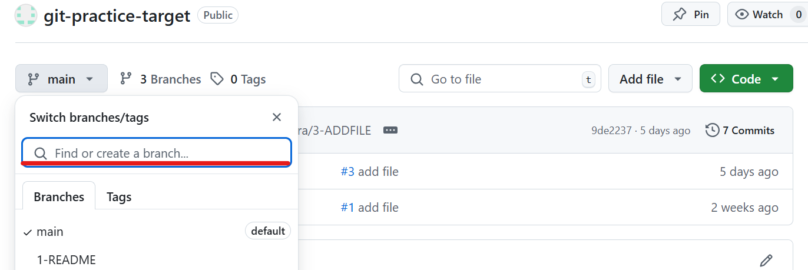
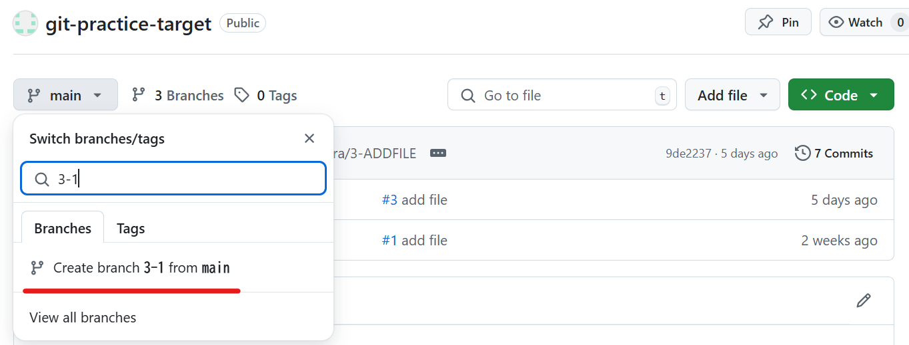
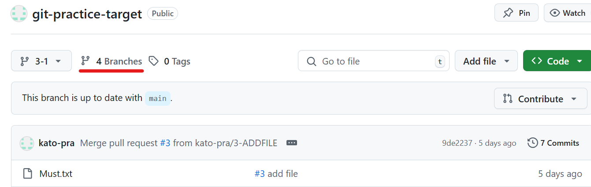
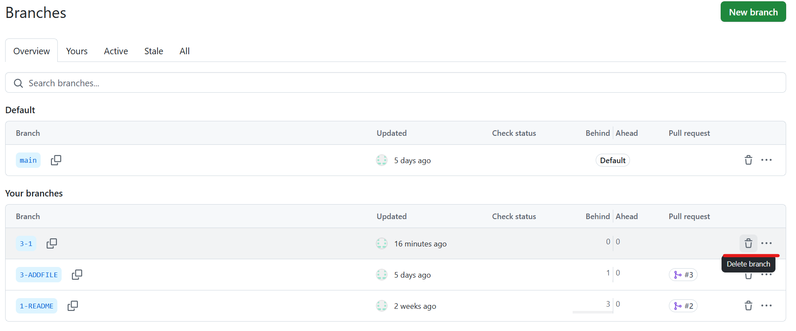

[TOP](../README.md)   
前: [実践](../basic/basic-practice.md)  
次: [他のブランチをマージ](./merge.md)  

---

# 3. 特定シチュエーションでの操作
Gitには、2章で行った基本的な操作の他にも特定シチュエーションで行う操作が複数あります。3章ではそれらの操作を取り上げます。  
3章のコンテンツは順不同で取り組んで構いません。また、必須ではありません。よりGitの操作に慣れたい方、実プロジェクトで必要になった方におすすめしています。

## 3-1. リモートリポジトリのブランチを取得
リモートリポジトリのブランチを取得するには`git fetch`を使います。`git fetch`を使うことでローカルリポジトリにリモート追跡ブランチが作成され、スイッチできるようになります。  
なお、ファイルやコードなどブランチの更新内容を取得するには`git pull`を使っていました。こちらでも`git fetch`と同等の処理が行われます。

1. コマンドプロンプトまたはPowerShellを使い、任意のディレクトリで`ターゲットリポジトリのクローンURL`を使いクローンしてください。  
なお、既にクローンしている場合はプルを行ってください。
2. ブラウザで`ターゲットリポジトリのページ`にアクセスし、「main」プルダウンから`Find or create branch...`にブランチ名を入力し、「Create branch: <ブランチ名>」からリモートリポジトリに新しいブランチを作成してください。ブランチ名は`3-1`とします。
3. コマンドプロンプトまたはPowerShellより、リモート追跡ブランチを含む全てのブランチを表示し、手順2で作成したブランチがまだ反映されていないことを確認してください。（ヒント：`-a`オプションを使います）
4. リモートリポジトリのブランチを取得してください。
5. リモート追跡ブランチを含む全てのブランチを表示し、手順2で作成したブランチが反映されていることを確認してください。（ヒント：`-a`オプションを使います）
6. スイッチし、手順2で作成したブランチに切り替えられることを確認してください。（ヒント：切り替え先ブランチ名は、`remotes/origin/`は不要でブランチ名のみで構いません）
7. 現在のブランチを確認します。以下のようにブランチ`3-1`が選択されていることを確認してください。（他のブランチがリストされていても構いません）
```
* 3-1
main
```
8. ブラウザで`ターゲットリポジトリのページ`にアクセスし、「main」プルダウン右横の「branches」より、手順2で作成したリモートのブランチを削除してください。右側の赤いゴミ箱アイコンより削除可能です。
9.  コマンドプロンプトまたはPowerShellを使い、現在のブランチをmainブランチに切り替えてください。
10.  手順6で作成したローカルのブランチを削除してください。

<details>
<summary>
答え(一例です)
</summary>

1. 
ディレクトリにターゲットリポジトリクローンがない場合
```
> git clone {ターゲットリポジトリのクローンURL}
```
既にディレクトリにターゲットリポジトリクローンがある場合
```
> git switch main
> git pull
```

2. 




3. 
```
> git branch -a
  1-README
  3-ADDFILE
* main
  remotes/origin/1-README
  remotes/origin/3-ADDFILE
  remotes/origin/main
```

4. 
```
> git fetch
From https://github.com/kato-pra/git-practice-target
 * [new branch]      3-1        -> origin/3-1
```

5. 
```
> git branch -a
  1-README
  3-ADDFILE
* main
  remotes/origin/1-README
  remotes/origin/3-1
  remotes/origin/3-ADDFILE
  remotes/origin/main
```

6. 
```
> git switch 3-1
branch '3-1' set up to track 'origin/3-1'.
Switched to a new branch '3-1'
```

7. 
```
> git branch
  1-README
* 3-1
  3-ADDFILE
  main
```

8. 




9. 
```
> git switch main
Switched to branch 'main'
Your branch is up to date with 'origin/main'.
```

10. 
```
> git branch -D 3-1
Deleted branch 3-1 (was 9de2237).
> git branch
  1-README
  3-ADDFILE
* main
```

</details>

--- 

[TOP](../README.md)   
前: [実践](../basic/basic-practice.md)  
次: [他のブランチをマージ](./merge.md)  