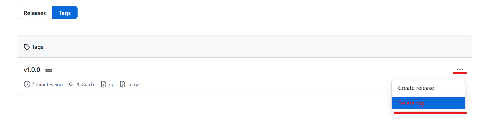

[TOP](../README.md)   
前: [ブランチを切り替え忘れて開発を進めてしまった場合](./stash.md)  
次: -

---

# 3. 特定シチュエーションでの操作
## 3-7. コミットへのタグ付け
`git tag`を使うことでコミットにタグを付けることができます。主にリリースバージョンをタグとして付けることが多いです。コミットにタグが付けられていると、後から特定のコミットを探し出すことが簡単になったり、GitHubの機能でリリースページを作ったりできます。  

1. コマンドプロンプトまたはPowerShellより、任意のディレクトリで`ターゲットリポジトリのクローンURL`を使いクローンしてください。
2. ローカルブランチ`3-7`を新しく作成し、切り替えてください。
3. 現在のブランチを確認します。以下のようにブランチ`3-7`が選択されていることを確認してください。（他のブランチがリストされていても構いません）
```
* 3-7
main
```
4. ファイル`3-7.txt`を新しく作成し、コミットしてください。（コミットのコメントは何でも構いません）
5. コミットにタグ`v1.0.0`を付けてください。（ヒント：注釈付きのタグを付けてみましょう。コメントは何でも構いません）
6. ブランチをプッシュしてください。リモートのブランチ名はローカルのブランチ名と同じにします。
7. タグをプッシュしてください。
8. ブラウザで`ターゲットリポジトリのページ`にアクセスし、"Releases > Tags"より、手順4で付けたタグが表示されていることを確認してください。これでリリースしたいコミットをリリースページに載せられるようになりました。
9.  ブラウザで`ターゲットリポジトリのページ`にアクセスし、"Releases > Releases > タグ名 > Delete this tag"より、手順4で付けたタグを削除してください。
10. ブラウザで`ターゲットリポジトリのページ`にアクセスし、「main」プルダウン右横の「branches」より、手順5でプッシュしたリモートのブランチを削除してください。
11. 手元の実行環境よりタグを削除してください。
12. mainブランチに切り替え、ローカルブランチ`3-7`を削除してください。

<details>
<summary>
答え(一例です)
</summary>

1. 
ディレクトリにターゲットリポジトリクローンがない場合
```
> git clone {ターゲットリポジトリのクローンURL}
```
既にディレクトリにターゲットリポジトリクローンがある場合
```
> git switch main
> git pull
```

2. 
```
> git branch 3-7
> git switch 3-7
```

3. 
```
> git branch
  1-README
* 3-7
  3-ADDFILE
  main
```

4. 
ファイル・ディレクトリの作成はGUIでも可能なため省略
```
> git add .
> git commit -m "3-7"
[3-7 9c8dafe] 3-7
 1 file changed, 0 insertions(+), 0 deletions(-)
 create mode 100644 3-7.txt
```

5. 
```
> git tag -a v1.0.0 -m "3-7tag"
```

6. 
```
> git push origin 3-7
Enumerating objects: 3, done.
Counting objects: 100% (3/3), done.
Delta compression using up to 16 threads
Compressing objects: 100% (2/2), done.
Writing objects: 100% (2/2), 245 bytes | 245.00 KiB/s, done.
Total 2 (delta 0), reused 0 (delta 0), pack-reused 0 (from 0)
remote:
remote: Create a pull request for '3-7' on GitHub by visiting:
remote:      https://github.com/kato-pra/git-practice-target/pull/new/3-7
remote:
To https://github.com/kato-pra/git-practice-target.git
 * [new branch]      3-7 -> 3-7
```

7. 
```
> git push origin v1.0.0
Enumerating objects: 1, done.
Counting objects: 100% (1/1), done.
Writing objects: 100% (1/1), 156 bytes | 156.00 KiB/s, done.
Total 1 (delta 0), reused 0 (delta 0), pack-reused 0 (from 0)
To https://github.com/kato-pra/git-practice-target.git
 * [new tag]         v1.0.0 -> v1.0.0
```

8. 

表示されないときはページの再読み込みを試してください


9. 


10. 3-1のプラクティス8の操作と同じです。参考にしてください。
11. 
```
> git tag -d v1.0.0
Deleted tag 'v1.0.0' (was 9730fe8)
```

12. 
```
> git switch main
Switched to branch 'main'
Your branch is up to date with 'origin/main'.
> git branch -D 3-7
Deleted branch 3-7 (was 9c8dafe).
```


<details>

--- 

[TOP](../README.md)   
前: [ブランチを切り替え忘れて開発を進めてしまった場合](./stash.md)  
次: -